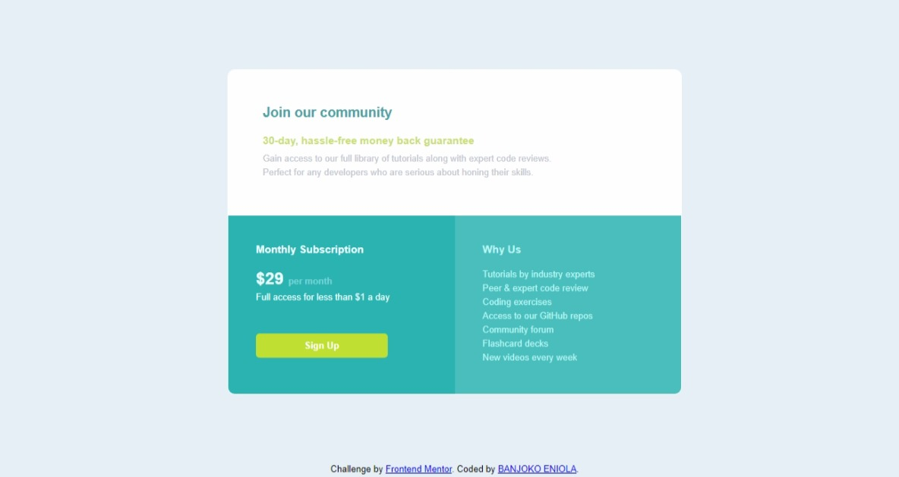

# Frontend Mentor -  Baanjoko Eniola Single price grid component solution

This is a solution to the [Single price grid component challenge on Frontend Mentor](https://www.frontendmentor.io/challenges/single-price-grid-component-5ce41129d0ff452fec5abbbc). Frontend Mentor challenges help you improve your coding skills by building realistic projects. 

## Table of contents

- [Frontend Mentor -  Baanjoko Eniola Single price grid component solution](#frontend-mentor----baanjoko-eniola-single-price-grid-component-solution)
  - [Table of contents](#table-of-contents)
  - [Overview](#overview)
    - [The challenge](#the-challenge)
    - [Screenshot](#screenshot)
    - [Links](#links)
  - [My process](#my-process)
    - [Built with](#built-with)
    - [What I learned](#what-i-learned)
  - [Author](#author)
  - [Acknowledgments](#acknowledgments)


## Overview

### The challenge

Users should be able to:

- View the optimal layout for the component depending on their device's screen size
- See a hover state on desktop for the Sign Up call-to-action

### Screenshot




### Links

- Solution URL: (https://github.com/Ayinketimi/Price-grid-component)
- Live Site URL: (https://graceful-puppy-37a75b.netlify.app/)

## My process

### Built with

- Semantic HTML5 markup
- CSS custom properties
- Flexbox
- CSS Grid
- Visual studio code

### What I learned
- I learnt how to create hoover effect on the signup button
- I learnt how to properly use flexbox to achieve the design
- i learnt hpw to muse <span> for in line styling
- i learnt how to create media quary for mobile design and others 

```html
<p class="doller">&dollar;29 <span class="month">per month</span></p>
```
```css
@media (max-width: 400px) {
.wrapper { flex-direction: column;}
.price, .reason { width: 100%;}
.container { width: 90%}
}
```


## Author

NAME: Banjoko Eniola

## Acknowledgments

I would like to acknowledge Web3schools and Black Adam my mentor for instilling the knowledge i applied to solving this challenge in me.
